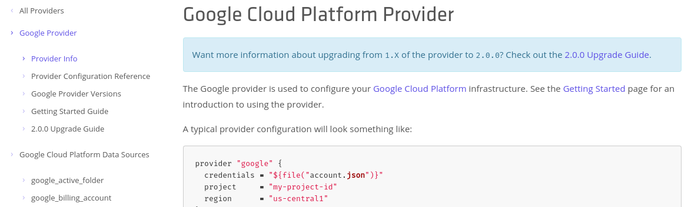

# Terraform

I'm not an expert,<br /> I've learnt something

<!--

Keeping this presentation simple

Used UK examples because of Brexit

Recent project experience:

- using terraform since May last year, mostly with Ansible
- disposable environments
- running in separate AWS sub-accounts

Not going to cover expert topics:

- loops
- kubernetes
- collaboration or remote backends
- module registry

How many people have used terraform before?

-->

---

```sh
$ terraform --version
Terraform v0.11.13
```

<!--

- breaking changes in 0.12
- delayed, quarter 1 2019
- improvements to Hashicorp Configuration Language HCL

-->

---

# HCL

<!--

1:1 mapping to JSON in 0.12

https://www.terraform.io/docs/glossary.html

-->

- Provider

<!-- plugin, tied to an infrastructure provider -->

- Resource

<!-- object that terraform manages: creates, modifies or destroys -->

- State

<!-- cached information about managed infrastructure, often shared -->

---

<span class=mono>gcp/provider.tf:</span>

`embed:gcp/provider.tf`

<!-- gcloud auth application-default login -->

---

# Provider documentation



https://www.terraform.io/docs/providers/google/index.html → "…/d/…"

<!-- https://www.terraform.io/docs/providers/google/d/datasource_compute_instance.html -->

---

```sh
$ terraform init
```

[Recording](/recorded/init.html)

<!--

cd ~/terraform/gcp
find .terraform
terraform init
find .terraform

look at .terraform
would include modules

-->

---

<span class=mono>./gcp/resource.tf:</span>

<div class="long">

`embed:gcp/resource.tf`

</div>

---

# Plan then apply

```sh
$ terraform apply
$ gcloud compute ssh example
```

<!--

Plan gives you a chance to check

Interactivity is optional

0.12 will have a machine readable plan output

Destroy does the opposite

-->

[Recording](/recorded/apply.html)

<!-- https://console.cloud.google.com/compute/instances -->

---

<span class=mono>./gcp/terraform.tfstate:</span>

<div class="twoColumn half">

```
{
    "version": 3,
    "terraform_version": "0.11.13",
    "serial": 3,
    "lineage": "████████-████-████-████-████████████",
    "modules": [
        {
            "path": [
                "root"
            ],
            "outputs": {},
            "resources": {
                "google_compute_instance.default": {
                    "type": "google_compute_instance",
                    "depends_on": [],
                    "primary": {
                        "id": "example",
                        "attributes": {
                            "attached_disk.#": "0",
✂
```

```
…
                        },
                        "meta": {
                            "████████-████-████-████-████████████": {
                                "create": 360000000000,
                                "delete": 360000000000,
                                "update": 360000000000
                            },
                            "schema_version": "6"
                        },
                        "tainted": false
                    },
                    "deposed": [],
                    "provider": "provider.google"
                }
            },
            "depends_on": []
        }
    ]
}
```

</div>

---

# Modules

> A module is a collection of .tf or .tf.json files kept together in a
> directory.

<!-- https://www.terraform.io/docs/configuration/index.html -->

- `variables.tf`: inputs, sometimes empty
- `main.tf`: resources
- `outputs.tf` sometimes empty

<!--

I often use modules to avoid repeating configuration

-->

---

<div class=majority>

<div>
<span class=mono>ubuntu/variables.tf</span> is empty
<span class=mono>ubuntu/main.tf:</span>

`embed:ubuntu/main.tf`

[Recording](/recorded/ubuntu.html)

</div>
<div>
<span class=mono>ubuntu/outputs.tf:</span>

`embed:ubuntu/outputs.tf`

```tf
module "ami" {
  source = "../../modules/ubuntu"
}

resource "aws_instance" "control" {
  ami = "${module.ami.id}"
✂
```

</div>

</div>

<!--

Can apply this module:

cd ~/terraform/ubuntu
terraform init
terraform apply

-->

---

# More advanced modules

- `override.tf` often in `.gitignore` better than `TF_VAR_name`
- symbolic links

> A module is a container for multiple resources that are used together.

<!--

Will change in 0.12

Example of overrides might be:

- SSH keys in a different local location
- an S3 bucket name

https://www.terraform.io/docs/configuration-0-11/override.html

-->

---

# Multi cloud

This demo shows one tool working across two cloud vendors, it isn't trying to be
a real world solution

<!--

The demo creates a bastion host on a Google Cloud and connection
to an EC2 instance

rm ~/.ssh/known_hosts
cd ~/terraform/multi
terraform init
terraform apply
ssh ubuntu@<DNS_name>  # times out
gcloud compute ssh example
ssh -A <address>
ssh ubuntu@<DNS_name>

-->

---

<!-- other things I'd like to mention -->

- `terraform fmt`

<!-- like black or prettier -->

- `tflint`

- Ansible terraform module

- Many [providers](https://www.terraform.io/docs/providers/index.html): ACME,
  kubernetes, PostgreSQL

- Overlap

- Chicken or egg? Provisioner calls terraform? Terraform calls provisioner?

---

# 11 March 2019

<div id=issue>

```sh
$ curl --silent https://releases.hashicorp.com/terraform/0.11.13/terraform_0.11.13_SHA256SUMS | grep linux_amd64
5925cd4d81e7d8f42a0054df2aafd66e2ab7408dbed2bd748f0022cfe592f8d2  terraform_0.11.13_linux_amd64.zip
$ curl --silent https://releases.hashicorp.com/terraform/0.11.13/terraform_0.11.13_SHA256SUMS | grep linux_amd64
d57dd17c61a63073191503302ea44352ba7a274e2c7944c4b38b97477a347aa5  terraform_0.11.13_linux_amd64.zip
```

> Very sorry you encountered this issue @maxwell-k. We pushed new zip files
> earlier today after getting feedback that the Solaris binaries did not got
> uploaded properly during the initial upload. ✂

> To be a bit more explicit, if a situation like this occurs again we plan to
> issue a new release and not re-issue a previous release.

— https://github.com/hashicorp/terraform/issues/20661

</div>

<!--

The Tao of HashiCorp is the foundation that guides our vision,
✂
Immutability is the inability to be changed
✂
https://www.hashicorp.com/tao-of-hashicorp


-->

---

# Why terraform?

- Reproducible
- More portable across vendors
- Open source

# Why not?

- Immediate prompts to update, unusual approach to versioning
- No backwards compatibility
- Tired of running VMs, want a managed service

---

# Questions?

<div class=right>

# Discussion

</div>

<hr />

<div class=twoColumn>

<keith.maxwell@gmail.com>

<https://www.linkedin.com/in/ksmaxwell/>

</div>

<hr />

```
terraform destroy
```

<!-- vim: set spellcapcheck= nowrap conceallevel=0 : -->
